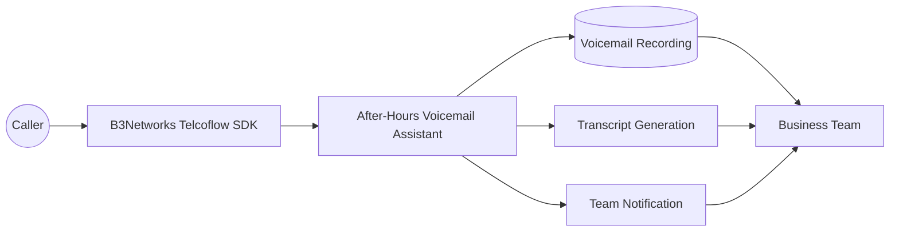
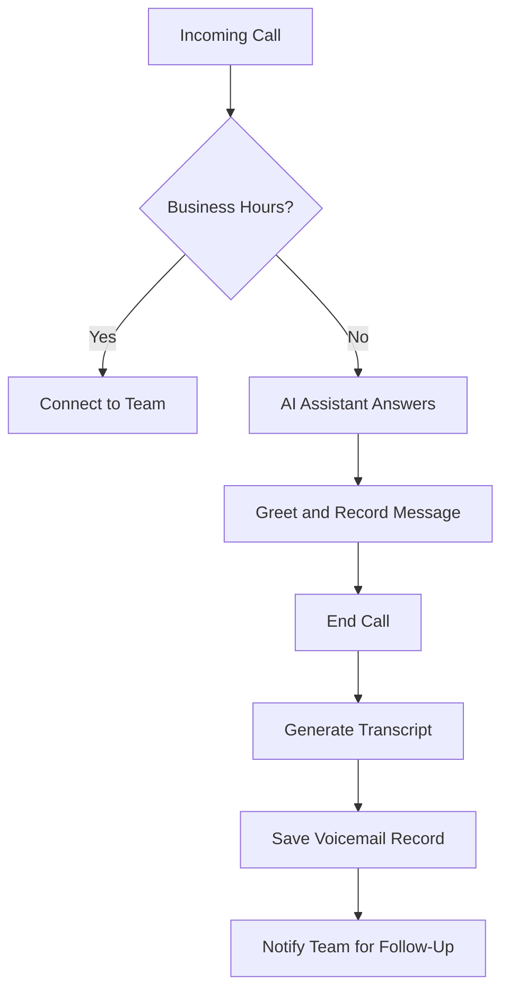
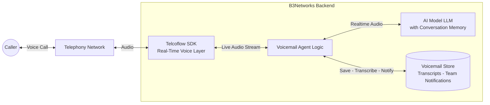
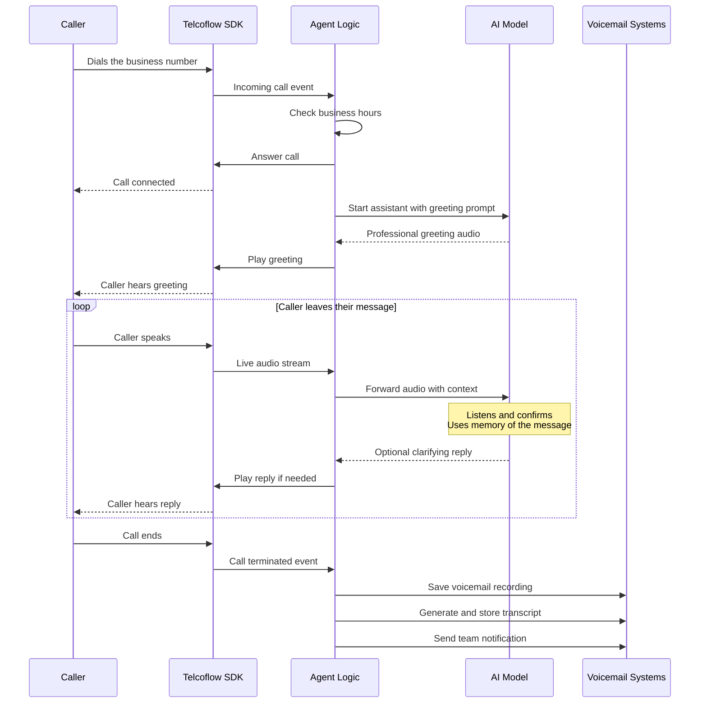

# Case Study: After-Hours Voicemail Assistant

### Executive Summary

Many businesses lose valuable opportunities after working hours. Customers call with urgent questions, service requests, or sales intent, but when nobody answers, those calls often turn into missed revenue, delayed support, and poor customer experience.

B3Networks delivers an after-hours voicemail solution built on the Telcoflow SDK and related services. It answers calls professionally, captures the caller's message, creates a written transcript, stores the interaction for follow-up, and alerts the team in real time — so no after-hours opportunity slips through unnoticed.

The result is a simple but high-impact experience:

- Customers are not left wondering whether their call was received.
- Teams wake up to clear, structured follow-up items instead of scattered missed calls.
- Businesses extend their responsiveness without extending staffing hours.

The assistant improves service availability while keeping the experience familiar, human, and operationally useful.

### Business Challenge

Outside of normal working hours, many organizations face the same challenge:

- Incoming calls continue, but live staff are unavailable.
- Callers may leave incomplete or unclear messages.
- Teams do not always have a reliable, centralized record of what was said.
- Follow-up can be delayed because information is trapped in a phone inbox or spread across devices.

For customer-facing businesses, this creates both perception and process issues. A missed call can feel like a missed relationship. Even when a voicemail exists, it may still take time to retrieve, listen to, summarize, and route to the right person.

This is especially important for businesses where timing matters, such as:

- Clinics and healthcare providers
- Property and maintenance teams
- Field service businesses
- Hospitality and travel operators
- Professional services firms
- Small and midsize sales teams

### Solution Overview

Built on the B3Networks Telcoflow SDK and supported by B3Networks services, the After-Hours Voicemail Assistant automatically decides what should happen when a call arrives.

During business hours, the call can be passed directly to the team.

After hours, the AI assistant answers the call, explains that the office is closed, invites the caller to leave a message, listens without interruption, and ends the interaction once the message is complete. After the call, the system processes the recording, generates a transcript, saves the interaction details, and sends a team notification.

In plain business terms, the solution delivers four outcomes:

1. It creates a reliable after-hours front door for inbound calls.
2. It turns a voice message into a structured business record.
3. It shortens the time from missed call to next action.
4. It provides a better customer experience than a basic unanswered line.

### Solution Diagrams

**Solution Overview**

**Call Flow**

### How It Works Under The Hood

This section provides a technical view of how the After-Hours Voicemail Assistant runs at call time. It shows how B3Networks combines the Telcoflow SDK with an AI model and the relevant business systems to deliver the solution.

**Runtime Architecture**

At runtime, this assistant connects four layers:

- **Caller** — the person on the phone outside business hours.
- **Telcoflow SDK** — the real-time voice layer that receives the call and streams audio in both directions.
- **Agent Logic** — decides what to do based on current time, business hours, and the state of the call.
- **AI Model (LLM)** — delivers the greeting, listens to the caller's message, and keeps memory of what was said so it can confirm or guide if needed.
- **Business Systems** — the voicemail store, transcription service, and team notification channels.

**Call Sequence**

In plain terms, a typical after-hours call looks like this:

1. A caller dials the business line and the Telcoflow SDK receives the call event.
2. The agent logic checks the current time. If it is outside business hours, the AI model is started and delivers a professional greeting.
3. While the caller records their message, the SDK streams the audio to the agent, which forwards it to the AI model. The AI model keeps memory of the message so it can confirm or gently guide the caller if needed.
4. When the caller hangs up, the agent saves the recording, generates a written transcript, and sends a team notification so staff can prioritize follow-up at the start of the next shift.

This technical flow follows the same structure as every other solution in the portfolio. Only the agent logic and the business systems change per use case, which is why B3Networks can deliver new solutions quickly while keeping the voice and AI foundation consistent.

### Experience And Workflow

#### Caller Experience

From the caller's perspective, the experience is simple and reassuring.

- The call is answered politely after hours.
- The caller hears that the business is currently closed.
- The caller is prompted to leave their name, number, and message.
- The system listens until the caller is finished.
- The caller receives confirmation that the message has been recorded and the team will follow up.

This matters because it removes uncertainty. Instead of hearing endless ringing or a generic mailbox prompt, the caller receives a clear and professional interaction that acknowledges their request.

#### Team Experience

From the team's perspective, the workflow is more actionable than a traditional voicemail box.

After the call ends, the system:

- Saves the voicemail recording
- Creates a text transcript of the message
- Stores the message details in a database
- Sends a notification to the team with the caller number, duration, transcript, and recording reference

This allows the next business-day follow-up process to start with context instead of guesswork.

### Business Impact

The After-Hours Voicemail Assistant solves a common operational gap with a clear return on value: every after-hours call is captured, structured, and routed to the right person instead of being lost.

#### 1. Better First Impression

Even when the office is closed, the business still sounds responsive and organized. That can improve trust, especially for new customers making a first inquiry.

#### 2. Fewer Lost Opportunities

Important details are captured immediately and delivered to the team in a usable format, reducing the risk that potential business disappears overnight.

#### 3. Faster Follow-Up

A transcript lets staff scan the issue quickly without listening to every recording from start to finish. That can reduce morning backlog and improve callback speed.

#### 4. Improved Internal Handoffs

Because the information is stored and shared consistently, it becomes easier to route the request to the right department or staff member.

#### 5. Scalable Service Coverage

Businesses can extend their availability outside staffing hours without needing a live overnight team for every inbound call.

### Example Scenario

A customer calls a home services company at 9:40 PM because their air conditioning has failed. No live agent is available.

Instead of reaching a generic voicemail box, the customer is greeted by an after-hours assistant that explains the office is closed and asks for their contact information and issue summary.

The customer leaves a message describing the problem and requests a morning callback.

By the time the team starts work the next day, they already have:

- The caller's phone number
- The audio recording
- A written transcript of the issue
- A notification sent to the team's collaboration channel

That means the first staff member reviewing overnight inquiries can immediately prioritize the case and respond faster.

### What B3Networks Delivers With The Telcoflow SDK

Through the Telcoflow SDK, B3Networks delivers:

- Real-time call handling for inbound voice workflows
- Logic-based call routing by business hours
- AI-powered voice interaction for natural after-hours conversations
- Post-call processing to convert audio into structured information
- Integration with business systems for notifications and record keeping

For non-technical buyers, the key message is simple: the SDK is not limited to answering calls. It can power complete business workflows around voice interactions.

### Operational Design

Although the user experience is simple, the design supports real operational use.

The solution includes:

- Business-hours awareness based on timezone and opening hours
- Audio capture of the caller's message
- Secure storage of voicemail records
- Transcript generation for fast review
- Team notifications for prompt action

The solution is suitable not only for demos, but as a production-ready foundation for organizations that want a more dependable after-hours process.

### Educational Value for Clients

The After-Hours Voicemail Assistant makes voice AI easy to understand by tying it to a familiar business operation that every leader has already experienced.

It shows that:

- AI can support a narrow, high-value workflow instead of trying to replace an entire contact center
- Voice automation can be introduced incrementally
- Business rules and human follow-up can still remain central to the customer journey

That makes it an effective entry point for organizations exploring AI and looking for a low-risk, practical starting point.

### Sales And Marketing Positioning

The headline messages for this solution are:

- Never let after-hours calls disappear into a black hole
- Turn voicemail into structured follow-up work
- Offer a professional caller experience even when the office is closed
- Give teams overnight visibility without overnight staffing
- Start with one workflow and expand to broader voice automation later

### Success Metrics Clients Can Track

To make the value concrete, clients can measure outcomes such as:

- Number of after-hours calls answered
- Percentage of voicemails successfully captured
- Average callback time the next business day
- Reduction in missed or abandoned inquiries
- Team response efficiency using transcript-based triage
- Conversion or resolution rate from after-hours inquiries

These metrics frame the assistant as a business outcome, not an AI demo.

### Ideal Client Profiles

This use case is especially well suited for organizations that:

- Receive meaningful inbound calls outside working hours
- Need a simple, trustworthy first automation use case
- Want better visibility into missed-call follow-up
- Need to modernize voicemail without redesigning their whole phone operation

It is a strong fit for both SMB and enterprise scenarios, particularly when responsiveness, professionalism, and auditability matter.

### Key Takeaway

With the After-Hours Voicemail Assistant, B3Networks combines the Telcoflow SDK and related services to deliver real-world voice-driven workflow — not just voice interaction.

Businesses stay responsive when staff are unavailable, unstructured audio becomes actionable information, and continuity improves between customer intent and team follow-up.

It is a practical, easy-to-understand starting point for any business beginning to explore voice AI — immediate value, minimal disruption to existing operations.

This is one of many solutions B3Networks can deliver on the Telcoflow SDK. Beyond this scenario, B3Networks designs and implements custom voice, telephony, automation, and workflow use cases tailored to each client's operational goals.
