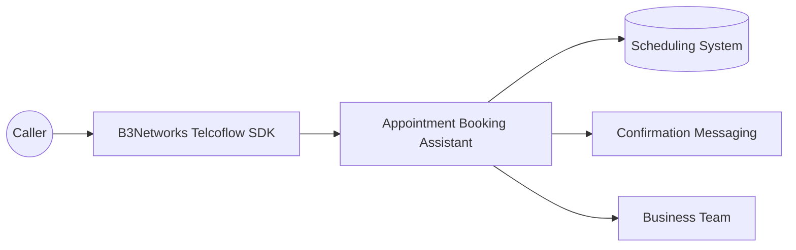
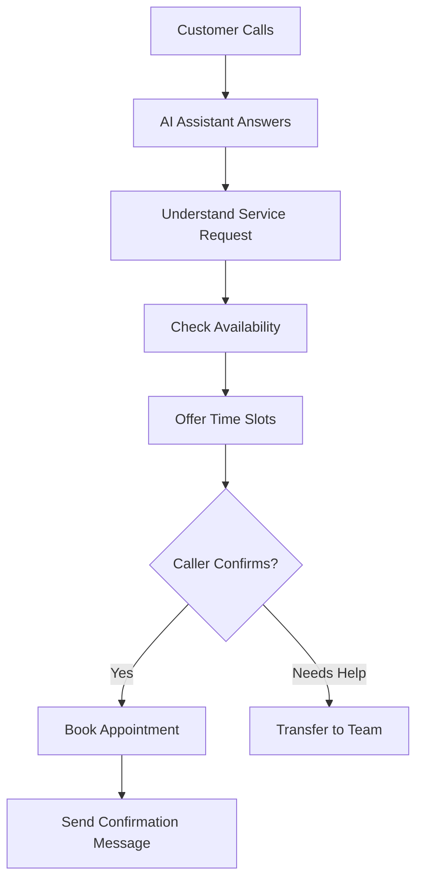

# Appointment Booking Assistant

## Client-Facing Case Study

### Executive Summary

Booking appointments over the phone is still a critical part of customer engagement across healthcare, professional services, beauty, field services, and many other industries. But manual phone scheduling often leads to long wait times, dropped calls, missed bookings, and unnecessary back-and-forth between customers and staff.

This case study highlights how B3Networks delivers a phone-based appointment automation solution through the Telcoflow SDK and related services, helping clients handle live booking conversations, check availability, confirm appointments, and send follow-up messages automatically.

The value is straightforward:

- Customers can book by speaking naturally over the phone.
- Teams reduce routine scheduling workload.
- Businesses capture more booking opportunities without increasing headcount.

This use case is especially effective for clients who want a practical voice AI workflow tied directly to revenue, convenience, and operational efficiency.

### Business Challenge

Many organizations still rely on human staff to answer calls, search calendars, confirm time slots, and repeat the same scheduling questions throughout the day.

That creates several challenges:

- Customers may call outside peak staffing capacity and abandon the booking attempt.
- Front-desk or support teams spend too much time on repetitive scheduling tasks.
- Booking errors happen when details are captured manually.
- Customers do not always receive a fast confirmation after the call.

The impact is larger than it appears. Appointment friction affects conversion, customer satisfaction, and staff productivity at the same time.

### Solution Overview

Built on the B3Networks Telcoflow SDK and supported by B3Networks services, the Appointment Booking Assistant creates a voice-based scheduling experience that can answer calls, guide customers through the booking flow, check availability, reserve a slot, and confirm the appointment.

From the client's point of view, this means the phone channel becomes more efficient without becoming impersonal.

The assistant can:

- Greet the caller and understand the requested service
- Check available appointment times
- Confirm the selected booking
- Send a confirmation message after the appointment is created
- Transfer the call to a human team member when needed

This transforms appointment booking from a labor-heavy phone process into a guided and scalable workflow.

### Solution Diagrams

**Solution Overview**

**Call Flow**

### Caller Experience

The caller does not need to navigate menus or wait for staff to search manually through a schedule.

Instead, the experience feels like a guided conversation:

- The caller explains the service they want
- The assistant offers available time slots
- The caller chooses a preferred option
- The assistant confirms the booking details
- A confirmation message is sent after the booking is completed

This is especially valuable for customers who still prefer calling over using a web form or app.

### Team Experience

For internal teams, the workflow reduces the burden of repetitive scheduling calls.

Instead of answering every booking request manually, staff can focus on:

- More complex customer issues
- High-value conversations
- Exception handling when special support is needed

Because the appointment flow is structured and consistent, businesses can improve operational reliability while also delivering a better customer experience.

### Business Impact

This use case is compelling for clients because it connects voice AI directly to a core business transaction.

#### 1. More Bookings Captured

Customers can complete scheduling quickly over the phone, reducing drop-off during the booking process.

#### 2. Reduced Administrative Work

Routine scheduling tasks no longer consume as much staff time, which improves efficiency for front-desk and operations teams.

#### 3. Better Customer Convenience

Callers can book through natural conversation rather than waiting on hold or navigating a rigid process.

#### 4. More Consistent Confirmation

Follow-up communication improves confidence and reduces missed appointments caused by unclear or incomplete booking details.

#### 5. Easy Path to Human Support

When the caller needs extra help or a special case is involved, the conversation can still be handed to a live team member.

### Example Scenario

A customer calls a clinic to schedule a general consultation.

Instead of waiting for a receptionist to become available, the caller is guided through the booking flow by a voice assistant. The assistant identifies the desired service, checks open time slots, confirms the customer's choice, and sends a confirmation message after the booking is completed.

If the caller asks for something more complex, such as rescheduling a specialist visit with special requirements, the assistant can route the call to the scheduling team.

This gives the client a blended service model: automation where it helps most, with human support where it matters most.

### What B3Networks Delivers With The Telcoflow SDK

This case study demonstrates how B3Networks can deliver the following through the Telcoflow SDK:

- Real-time voice interactions over live calls
- Availability checks as part of a conversational workflow
- Booking confirmation and downstream communication
- Human handoff when escalation is appropriate
- Integration between telephony and business operations

For client conversations, this is an excellent example of the SDK supporting not just call handling, but end-to-end workflow execution.

### Ideal Client Profiles

This solution is especially relevant for:

- Clinics and healthcare providers
- Salons and wellness businesses
- Professional services firms
- Education and training providers
- Repair and field service teams
- Any business that books appointments by phone

It is particularly useful where inbound booking volume is high and staff time is expensive.

### Success Metrics Clients Can Track

Clients can evaluate impact using metrics such as:

- Appointment conversion rate from inbound calls
- Average booking time per call
- Number of bookings handled without live staff involvement
- Reduction in call abandonment during scheduling
- Customer confirmation delivery rate
- Staff time saved on repetitive phone scheduling

These measures help position the workflow as a business improvement, not just an AI demonstration.

### Sales And Marketing Positioning

This use case is strong in client-facing material because it tells a simple and commercially relevant story:

- Turn phone calls into completed bookings
- Reduce front-desk workload without reducing service quality
- Offer a smoother scheduling experience for callers
- Blend automation with live support when needed
- Modernize appointment handling without forcing customers into digital-only channels

### Key Takeaway

The Appointment Booking Assistant is a clear demonstration of how B3Networks combines the Telcoflow SDK and implementation services to automate one of the most common and valuable phone-based business workflows.

It helps clients improve conversion, reduce operational strain, and create a more convenient experience for callers. For marketing and education purposes, it is a strong example of practical voice AI that delivers immediate business value.

This case study is intended as a representative example of what B3Networks can deliver with the Telcoflow SDK and related services. Beyond this scenario, B3Networks can also design and implement additional custom voice, telephony, automation, and workflow use cases based on each client's operational needs.

### Short Version for Google Doc Cover Page

The Appointment Booking Assistant shows how B3Networks can turn inbound calls into completed appointments through a solution built on the Telcoflow SDK. Instead of relying entirely on staff to handle repetitive scheduling requests, the solution guides callers through availability checks, booking confirmation, and follow-up messaging, while still allowing human transfer when needed. It is a compelling example of voice AI improving both customer convenience and business efficiency.
