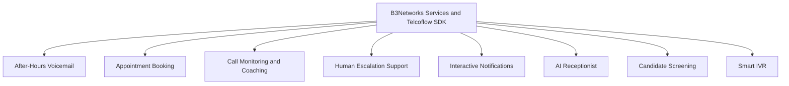

# B3Networks Telcoflow SDK Case Studies Overview

## Executive Overview

B3Networks helps clients design and deliver modern voice, telephony, and workflow solutions using the Telcoflow SDK and related services. These solutions are built to improve customer experience, reduce operational friction, and turn voice interactions into structured, actionable business workflows.

The case studies in this pack present a selected set of representative solution patterns. They are intended to show the breadth of what can be delivered with the Telcoflow SDK, not the full limit of what is possible. Depending on business requirements, B3Networks can also design and implement additional custom use cases across voice automation, intelligent routing, notifications, support operations, customer engagement, internal workflows, and telephony-driven process automation.

## Portfolio At A Glance

This diagram shows how each solution in the portfolio is built on the same foundation of B3Networks services and the Telcoflow SDK, while addressing a different business workflow.

## What The Telcoflow SDK Enables

The Telcoflow SDK gives B3Networks a flexible foundation for building voice-enabled business workflows that go far beyond traditional telephony.

With the Telcoflow SDK, B3Networks can help clients:

- Handle inbound and outbound voice interactions in real time
- Replace static call flows with conversational experiences
- Route calls intelligently based on context, timing, or user intent
- Combine AI-driven interaction with live human handoff
- Capture business data during calls and connect it to downstream systems
- Turn voice conversations into operational workflows, not just call events

This makes the platform suitable for both customer-facing and internal business use cases.

## Why These Case Studies Matter

Many organizations understand the promise of AI, but they need concrete examples of how it applies to real business workflows. These case studies are designed to make that value tangible.

They show how B3Networks can help clients:

- Improve responsiveness and service quality
- Reduce repetitive manual workload
- Modernize outdated telephony experiences
- Add intelligence to live customer interactions
- Support both automation-first and human-in-the-loop operating models

Each example is intentionally practical and commercially relevant, making the pack useful for client education, sales enablement, solution discussions, and proposal support.

## Case Study Portfolio

### 1. After-Hours Voicemail Assistant

Demonstrates how B3Networks can help clients stay responsive outside business hours by answering calls, recording messages, generating transcripts, and alerting teams for follow-up.

### 2. Appointment Booking Assistant

Shows how phone-based scheduling can be streamlined through conversational booking, availability checking, appointment confirmation, and follow-up messaging.

### 3. Call Monitoring And Coaching Assistant

Illustrates how live customer conversations can be monitored in real time to support human agents with private coaching and performance insights during the call itself.

### 4. Human Escalation Support Assistant

Shows how routine support calls can be automated while preserving a smooth, context-aware handoff to human staff when more complex help is required.

### 5. Interactive Notifications Assistant

Demonstrates how one-way notifications can become interactive voice conversations, allowing customers to acknowledge messages or request follow-up in a structured way.

### 6. AI Receptionist Assistant

Highlights how inbound call handling can be modernized through caller recognition, contextual support, smarter routing, and more personalized first-contact experiences.

### 7. Candidate Screening Assistant

Shows how structured first-round phone screening can be automated to support recruiting teams with more scalable and consistent intake workflows.

### 8. Smart IVR Assistant

Demonstrates how traditional keypad-driven IVR menus can be replaced by natural voice conversations that support both self-service and intelligent routing.

## Solution Capability Matrix

The matrix below maps each use case in this pack to the core capabilities it demonstrates. It helps clients quickly see which building blocks are available through the Telcoflow SDK and how they can be combined into different business solutions.

**Use case codes**

- **AHV** — After-Hours Voicemail Assistant
- **APT** — Appointment Booking Assistant
- **CMC** — Call Monitoring And Coaching Assistant
- **ESC** — Human Escalation Support Assistant
- **NOT** — Interactive Notifications Assistant
- **REC** — AI Receptionist Assistant
- **SCR** — Candidate Screening Assistant
- **IVR** — Smart IVR Assistant

**Capability coverage**

| Capability | AHV | APT | CMC | ESC | NOT | REC | SCR | IVR |
| --- | :---: | :---: | :---: | :---: | :---: | :---: | :---: | :---: |
| Real-time AI voice conversation | Yes | Yes | Yes | Yes | Yes | Yes | Yes | Yes |
| Inbound call handling | Yes | Yes | Yes | Yes | Yes | Yes | Yes | Yes |
| Outbound / interactive voice delivery |  |  |  |  | Yes |  |  |  |
| Logic-based call routing | Yes | Yes |  | Yes |  | Yes |  | Yes |
| Intent detection and understanding |  | Yes | Yes | Yes | Yes | Yes |  | Yes |
| Conversational self-service |  | Yes |  | Yes | Yes | Yes |  | Yes |
| Call transcription and summarization | Yes |  | Yes |  | Yes |  | Yes |  |
| Caller identification and personalization |  |  |  |  | Yes | Yes |  |  |
| Structured data capture and storage | Yes | Yes | Yes | Yes | Yes | Yes | Yes | Yes |
| Calendar or scheduling integration |  | Yes |  |  |  |  |  |  |
| Messaging and confirmation workflows |  | Yes |  |  | Yes |  |  |  |
| Live monitoring and real-time coaching |  |  | Yes |  |  |  |  |  |
| Human handoff with context |  | Yes |  | Yes |  | Yes |  | Yes |
| Team notifications and alerting | Yes | Yes |  | Yes | Yes |  | Yes |  |
| Automated evaluation and scoring |  |  | Yes |  |  |  | Yes |  |
| Analytics and operational reporting | Yes | Yes | Yes | Yes | Yes | Yes | Yes | Yes |

**How to read this matrix**

- Each column is a case study in this pack.
- Each row is a capability delivered through B3Networks services and the Telcoflow SDK.
- A filled cell means the case study is a strong demonstration of that capability.
- An empty cell does not mean the capability is unavailable for that scenario. It simply means that capability is not the focus of that particular example.

This matrix is especially useful during client discovery. By selecting the capabilities most relevant to a client's operational goals, B3Networks can quickly shape a tailored solution proposal using patterns already proven in this portfolio.

## Common Value Themes Across The Portfolio

Although each use case addresses a different business challenge, several common themes run across the portfolio:

- Better customer and caller experience
- Faster access to information and outcomes
- Reduced manual operational effort
- Improved workflow consistency
- More meaningful use of telephony data
- Stronger integration between conversations and business processes

These recurring patterns are important because they show that voice AI is not just about answering calls. It is about improving how organizations operate around calls.

## How Clients Can Use This Pack

This case study pack can be used in several ways:

- As a sales and marketing asset to demonstrate real-world solution possibilities
- As an educational guide for clients exploring voice AI for the first time
- As a workshop starter for identifying which workflows are best suited for automation
- As a reference point for designing custom solutions using the Telcoflow SDK

For some clients, one of these examples may be immediately deployable with adaptation. For others, the value may be in using the examples as reference architectures for a more customized engagement.

## Positioning Statement

These case studies are representative examples of what B3Networks can deliver with the Telcoflow SDK and related services. They are not intended to limit the scope of available solutions. B3Networks can also design and implement additional custom voice, telephony, automation, routing, notification, support, and workflow use cases based on each client's specific operational goals.

## Closing Summary

Together, these examples show that the B3Networks Telcoflow SDK is not limited to a single type of AI agent or a narrow telephony use case. It provides a flexible foundation for designing practical, business-oriented voice solutions that can improve service, efficiency, responsiveness, and operational visibility.

For client conversations, this portfolio helps tell a clear story: B3Networks does not just provide telephony technology. It helps organizations turn voice interactions into smarter business outcomes.
