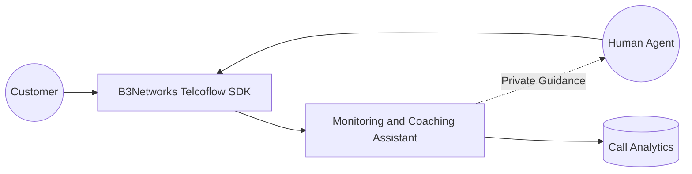
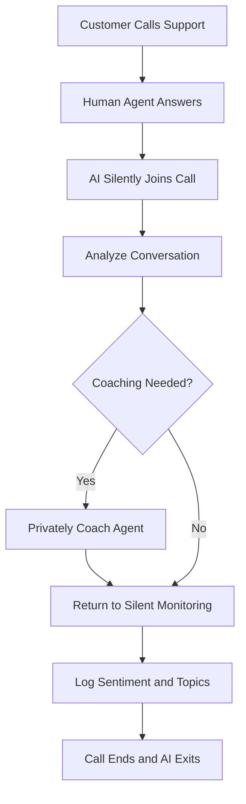

# Call Monitoring And Coaching Assistant

## Client-Facing Case Study

### Executive Summary

Support quality depends heavily on what happens during live conversations, but most organizations only review calls after the fact. That means coaching opportunities, customer frustration, and service-risk moments are often discovered too late.

This case study highlights how B3Networks delivers a live call intelligence solution through the Telcoflow SDK and related services, helping clients listen to customer calls, detect issues in real time, and provide private coaching guidance to human agents during the interaction.

The result is a higher-value support environment where businesses can improve service quality while calls are still in progress, not only after the interaction has ended.

### Business Challenge

Traditional quality assurance is often reactive.

Managers may review a small percentage of calls after they are completed, but by then:

- The customer experience has already been affected
- Coaching is delayed
- Escalation opportunities may be missed
- Patterns in sentiment or call difficulty are harder to act on immediately

Organizations with large customer service or sales teams need a way to support frontline staff in the moment, especially during difficult interactions.

### Solution Overview

Built on the B3Networks Telcoflow SDK and supported by B3Networks services, the Call Monitoring and Coaching Assistant can join live calls, analyze the conversation, and support the human agent without disrupting the customer experience.

The assistant can:

- Monitor both sides of a live conversation
- Detect customer sentiment and friction signals
- Identify when the agent may need support
- Deliver private guidance to the agent during the call
- Log useful analytics for later review

This allows clients to combine real-time assistance with longer-term performance insights.

### Solution Diagrams

**Solution Overview**

**Call Flow**

### Experience And Workflow

From the customer's perspective, the conversation remains with the human representative.

From the agent's perspective, the assistant acts like a real-time coach:

- It listens to the conversation
- It detects moments of hesitation, tension, or opportunity
- It can provide guidance privately to the agent
- It helps the agent respond more effectively before the moment is lost

This is especially valuable for newer team members, complex support environments, and high-stakes service interactions.

### Business Impact

This workflow demonstrates a more advanced and differentiated use of voice AI.

#### 1. Better Agent Performance During The Call

Instead of waiting for after-call feedback, the agent receives support while the customer is still on the line.

#### 2. Improved Customer Experience

When agents respond with better phrasing, stronger empathy, or clearer resolution steps, the customer benefits immediately.

#### 3. Stronger Quality Assurance

Call monitoring becomes more than passive observation. It becomes an active improvement layer.

#### 4. Useful Analytics

Sentiment and topic logging help clients understand what is happening across calls, not just on individual conversations.

#### 5. Scalable Coaching

Supervisors do not need to manually monitor every difficult conversation in real time to provide support.

### Example Scenario

A customer calls to complain about a delayed refund and sounds frustrated. The human agent is trying to help but is not addressing the customer's emotional concern effectively.

The assistant detects the negative sentiment and privately coaches the agent with a suggestion such as acknowledging the delay, apologizing clearly, and offering a direct next step.

The agent applies the guidance immediately, and the conversation recovers.

What would traditionally be a poor-quality call now becomes a better-managed service interaction.

### What B3Networks Delivers With The Telcoflow SDK

This use case highlights how B3Networks can deliver the following through the Telcoflow SDK:

- Live voice supervision and call participation
- Silent monitoring and private agent guidance
- AI-assisted decision support during ongoing calls
- Real-time conversation analytics
- Better integration between telephony and service quality workflows

For clients, this shows that the SDK can support not only self-service use cases, but also human-in-the-loop performance improvement.

### Ideal Client Profiles

This use case is especially relevant for:

- Customer support centers
- Sales teams handling live phone conversations
- Financial services contact teams
- Insurance and service resolution teams
- Outsourced contact centers
- Businesses with high training or quality-assurance needs

It is particularly strong where call quality has a direct effect on customer retention or regulatory confidence.

### Success Metrics Clients Can Track

Clients can measure value through:

- Improvement in call resolution outcomes
- Reduced escalation rates
- Increased customer satisfaction scores
- Better compliance with conversation standards
- Faster onboarding for new agents
- Trends in sentiment and coaching frequency

These metrics help position the workflow as an operational performance tool rather than just a voice experiment.

### Sales And Marketing Positioning

This case study gives B3Networks a strong advanced-use-case story:

- Support agents in real time, not only after the call
- Turn live conversations into moments for guided performance improvement
- Improve quality assurance without increasing supervisor overhead
- Help teams manage difficult calls more effectively
- Add intelligence to human-led service environments

### Key Takeaway

The Call Monitoring and Coaching Assistant demonstrates how B3Networks combines the Telcoflow SDK and service expertise to enhance live human conversations, not just automate them.

It is a strong case study for clients who want AI to improve agent performance, customer experience, and service quality in real time. For educational and marketing use, it is one of the most compelling examples of how voice intelligence can work alongside human teams.

This case study is intended as a representative example of what B3Networks can deliver with the Telcoflow SDK and related services. Beyond this scenario, B3Networks can also design and implement additional custom voice, telephony, automation, and workflow use cases based on each client's operational needs.