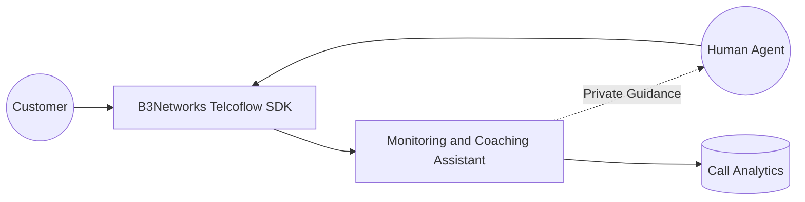
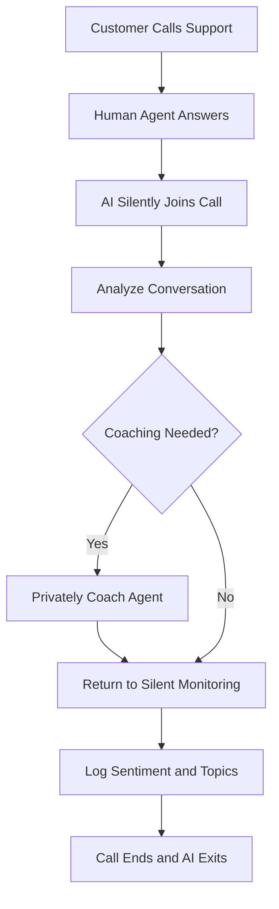
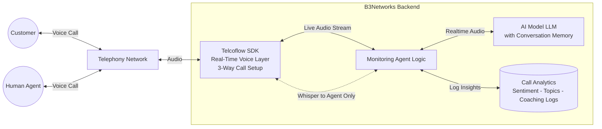
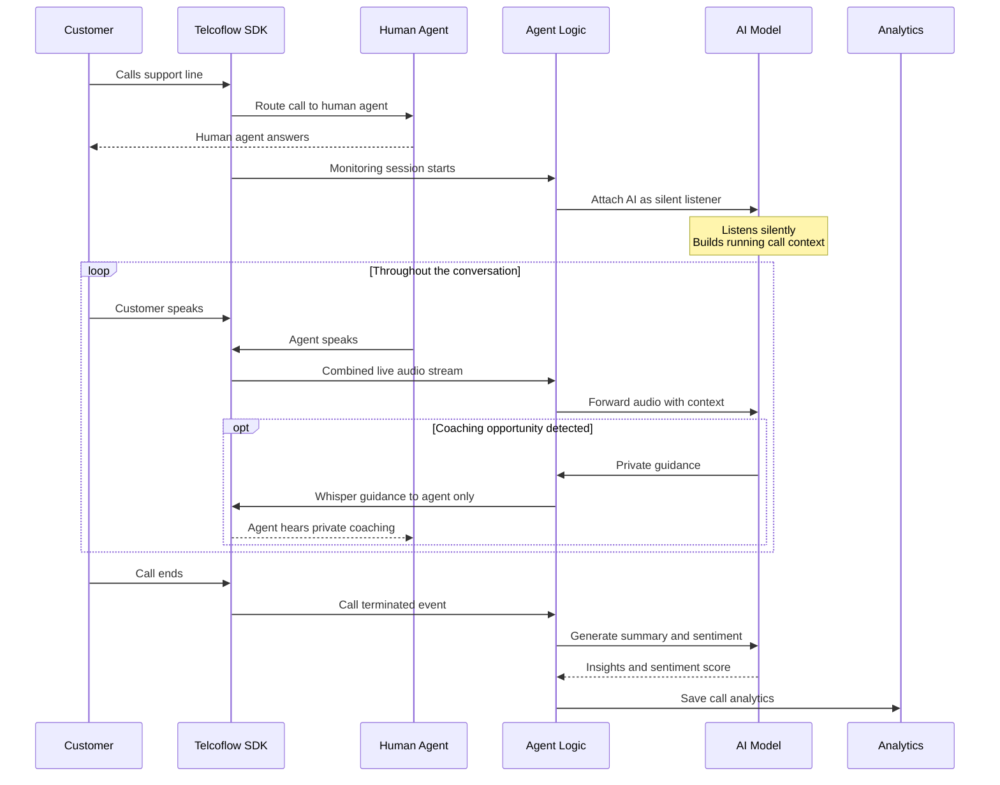

# Case Study: Call Monitoring and Coaching Assistant

### Executive Summary

Support quality depends heavily on what happens during live conversations, but most organizations only review calls after the fact. That means coaching opportunities, customer frustration, and service-risk moments are often discovered too late.

B3Networks delivers a live call intelligence solution built on the Telcoflow SDK and related services. It listens to customer calls, detects issues in real time, and provides private coaching guidance to human agents during the interaction — improving service quality on every call without disrupting the customer experience.

The result is a higher-value support environment where businesses can improve service quality while calls are still in progress, not only after the interaction has ended.

### Business Challenge

Traditional quality assurance is often reactive.

Managers may review a small percentage of calls after they are completed, but by then:

- The customer experience has already been affected
- Coaching is delayed
- Escalation opportunities may be missed
- Patterns in sentiment or call difficulty are harder to act on immediately

Organizations with large customer service or sales teams need a way to support frontline staff in the moment, especially during difficult interactions.

### Solution Overview

Built on the B3Networks Telcoflow SDK and supported by B3Networks services, the Call Monitoring and Coaching Assistant can join live calls, analyze the conversation, and support the human agent without disrupting the customer experience.

The assistant can:

- Monitor both sides of a live conversation
- Detect customer sentiment and friction signals
- Identify when the agent may need support
- Deliver private guidance to the agent during the call
- Log useful analytics for later review

This allows clients to combine real-time assistance with longer-term performance insights.

### Solution Diagrams

**Solution Overview**

**Call Flow**

### How It Works Under The Hood

This section provides a technical view of how the Call Monitoring And Coaching Assistant runs at call time. It shows how B3Networks combines the Telcoflow SDK with an AI model and the relevant business systems to deliver the solution.

**Runtime Architecture**

At runtime, this assistant connects four layers with one important twist: the AI model is a silent third participant on a live human-to-customer call.

- **Customer** — the person calling the support line.
- **Human Agent** — the live staff member handling the call.
- **Telcoflow SDK** — sets up the 3-way call and separates the public audio path from the private whisper path so the customer never hears the coaching.
- **Agent Logic** — attaches the AI model to the live call and routes private guidance back to the human agent only.
- **AI Model (LLM)** — listens to the full conversation, keeps memory of the call, and sends private coaching cues when it detects a useful moment.
- **Business Systems** — the call analytics store, where sentiment, topics, and coaching events are logged for supervisor review.

**Call Sequence**

In plain terms, a typical monitored call looks like this:

1. A customer calls the support line and the SDK routes the call to a human agent.
2. The AI model silently joins the call as a third participant, listening only. It never speaks to the customer.
3. While both parties speak, the Telcoflow SDK streams the combined audio to the agent, which forwards it to the AI model. The AI model builds a running understanding of the conversation, tracking sentiment and topics.
4. If the AI model detects a coaching opportunity, it sends private guidance back through the SDK's whisper capability so only the human agent hears it. The customer does not hear anything from the AI.
5. When the call ends, the AI model generates a summary and sentiment score, which is saved to analytics for supervisor review.

This technical flow follows the same structure as every other solution in the portfolio. Only the agent logic and the business systems change per use case, which is why B3Networks can deliver new solutions quickly while keeping the voice and AI foundation consistent.

### Experience And Workflow

From the customer's perspective, the conversation remains with the human representative.

From the agent's perspective, the assistant acts like a real-time coach:

- It listens to the conversation
- It detects moments of hesitation, tension, or opportunity
- It can provide guidance privately to the agent
- It helps the agent respond more effectively before the moment is lost

This is especially valuable for newer team members, complex support environments, and high-stakes service interactions.

### Business Impact

This workflow demonstrates a more advanced and differentiated use of voice AI.

#### 1. Better Agent Performance During The Call

Instead of waiting for after-call feedback, the agent receives support while the customer is still on the line.

#### 2. Improved Customer Experience

When agents respond with better phrasing, stronger empathy, or clearer resolution steps, the customer benefits immediately.

#### 3. Stronger Quality Assurance

Call monitoring becomes more than passive observation. It becomes an active improvement layer.

#### 4. Useful Analytics

Sentiment and topic logging help clients understand what is happening across calls, not just on individual conversations.

#### 5. Scalable Coaching

Supervisors do not need to manually monitor every difficult conversation in real time to provide support.

### Example Scenario

A customer calls to complain about a delayed refund and sounds frustrated. The human agent is trying to help but is not addressing the customer's emotional concern effectively.

The assistant detects the negative sentiment and privately coaches the agent with a suggestion such as acknowledging the delay, apologizing clearly, and offering a direct next step.

The agent applies the guidance immediately, and the conversation recovers.

What would traditionally be a poor-quality call now becomes a better-managed service interaction.

### What B3Networks Delivers With The Telcoflow SDK

Through the Telcoflow SDK, B3Networks delivers:

- Live voice supervision and call participation
- Silent monitoring and private agent guidance
- AI-assisted decision support during ongoing calls
- Real-time conversation analytics
- Better integration between telephony and service quality workflows

For clients, this shows that the SDK can support not only self-service use cases, but also human-in-the-loop performance improvement.

### Ideal Client Profiles

This use case is especially relevant for:

- Customer support centers
- Sales teams handling live phone conversations
- Financial services contact teams
- Insurance and service resolution teams
- Outsourced contact centers
- Businesses with high training or quality-assurance needs

It is particularly strong where call quality has a direct effect on customer retention or regulatory confidence.

### Success Metrics Clients Can Track

Clients can measure value through:

- Improvement in call resolution outcomes
- Reduced escalation rates
- Increased customer satisfaction scores
- Better compliance with conversation standards
- Faster onboarding for new agents
- Trends in sentiment and coaching frequency

These metrics help position the workflow as an operational performance tool rather than just a voice experiment.

### Sales And Marketing Positioning

The Call Monitoring and Coaching Assistant supports an advanced-use-case narrative:

- Support agents in real time, not only after the call
- Turn live conversations into moments for guided performance improvement
- Improve quality assurance without increasing supervisor overhead
- Help teams manage difficult calls more effectively
- Add intelligence to human-led service environments

### Key Takeaway

The Call Monitoring and Coaching Assistant demonstrates how B3Networks combines the Telcoflow SDK and service expertise to enhance live human conversations, not just automate them.

It is designed for clients who want AI to improve agent performance, customer experience, and service quality in real time — a clear example of how voice intelligence can work alongside human teams rather than replace them.

This is one of many solutions B3Networks can deliver on the Telcoflow SDK. Beyond this scenario, B3Networks designs and implements custom voice, telephony, automation, and workflow use cases tailored to each client's operational goals.