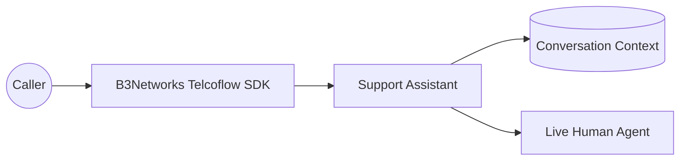
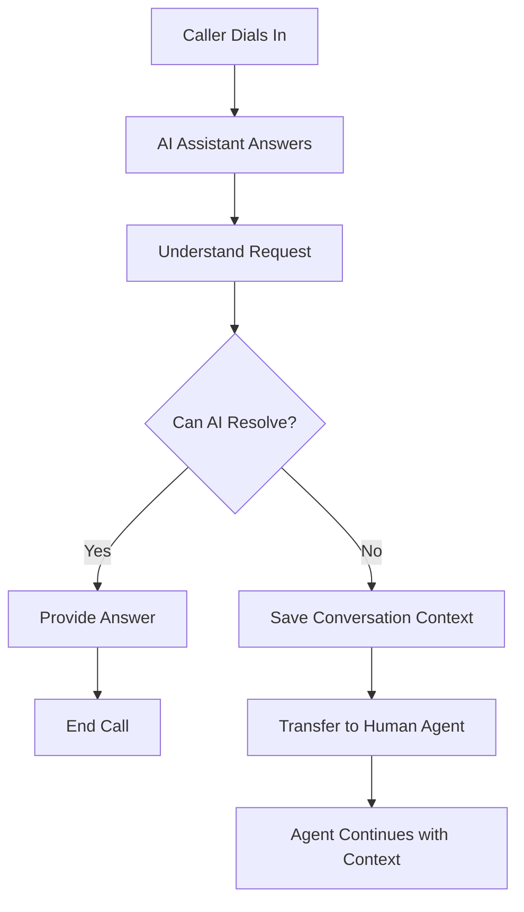

# Human Escalation Support Assistant

## Client-Facing Case Study

### Executive Summary

Many businesses want to automate support calls, but full automation is rarely the right answer for every situation. Some inquiries can be handled quickly by AI, while others require human judgment, account access, or a higher level of empathy.

This case study highlights how B3Networks delivers a hybrid support solution through the Telcoflow SDK and related services, helping clients handle routine voice interactions while seamlessly transferring more complex calls to a live team member.

This makes the use case especially attractive for clients who want automation with control. It demonstrates that AI can improve efficiency without forcing businesses to give up the human safety net that customers still expect.

### Business Challenge

When organizations introduce voice automation, one concern comes up repeatedly: what happens when the issue is too complex, too sensitive, or too specific for AI to resolve well?

Without a strong escalation path, businesses risk:

- Frustrating callers
- Repeating information after transfer
- Increasing handle time instead of reducing it
- Damaging trust during complex service issues

Many clients do not want an all-or-nothing automation strategy. They want AI to handle common questions while handing off the rest smoothly.

### Solution Overview

Built on the B3Networks Telcoflow SDK and supported by B3Networks services, the Human Escalation Support Assistant can answer incoming calls, assist callers with routine questions, and escalate the conversation to a human when needed.

The assistant can:

- Handle straightforward support questions directly
- Recognize when a request requires human help
- Escalate at the customer's request
- Pass the call to a live team member
- Preserve useful conversation context to reduce repetition

This creates a more realistic and enterprise-friendly voice AI model: automate what can be automated, and transition gracefully when it cannot.

### Solution Diagrams

**Solution Overview**

**Call Flow**

### Experience And Workflow

From the caller's perspective, the experience is efficient and reassuring.

If the issue is simple, the assistant resolves it quickly.

If the issue is more sensitive or complex, the assistant explains that it is connecting the caller with a human team member and passes along the interaction context so the caller does not need to start over.

This is a major experience improvement over poorly designed automation flows that trap callers in dead ends.

### Business Impact

This use case matters because escalation is not a failure. In many industries, escalation is part of a well-designed service journey.

#### 1. Better Use Of Automation

Routine questions can be resolved efficiently without live staff involvement.

#### 2. Safer Customer Experience

High-complexity or sensitive issues are not forced through an unsuitable automated path.

#### 3. Lower Friction During Transfer

Preserving the conversation context reduces repetition and improves continuity.

#### 4. Stronger Client Confidence

Businesses are more likely to adopt AI when they know there is a reliable human fallback.

#### 5. Scalable Support Operations

Teams can focus their attention on the issues where human expertise adds the most value.

### Example Scenario

A caller contacts a business to dispute a billing charge.

The assistant gathers the basic issue, recognizes that the matter requires account-level access or human review, and informs the caller that it will connect them to a specialist.

The call is transferred, and the summary of the issue is available for the next team member.

The customer gets a smoother handoff, and the business avoids using AI where human judgment is more appropriate.

### What B3Networks Delivers With The Telcoflow SDK

This case study demonstrates how B3Networks can deliver the following through the Telcoflow SDK:

- Incoming call handling with natural voice interaction
- AI-led first-line support for common issues
- Escalation triggers based on user need or business policy
- Live transfer to a human agent
- Context preservation for smoother handoffs

For client discussions, this is an important reassurance use case. It shows that the SDK supports responsible voice AI design, not just automation for its own sake.

### Ideal Client Profiles

This use case is highly relevant for:

- Customer support teams
- Financial services operations
- Utilities and telecom support
- SaaS and software support desks
- Healthcare administration teams
- Businesses where some requests require secure or regulated human review

It is especially attractive for organizations that want to begin with AI-assisted support while keeping service quality and trust high.

### Success Metrics Clients Can Track

Clients can evaluate impact through:

- Percentage of calls resolved without escalation
- Average time to successful handoff
- Reduction in caller repetition after transfer
- Customer satisfaction across AI-handled and escalated calls
- Agent productivity improvement for complex call queues
- Containment rate for routine support requests

These measures help show that the value lies not just in automation volume, but in better support design.

### Sales And Marketing Positioning

This case study is useful in client conversations because it addresses a common hesitation around AI adoption:

- Automate routine calls without losing the human option
- Give customers a smoother path from AI support to live support
- Reduce friction during call transfers
- Preserve context and continuity
- Build trust with a practical hybrid support model

### Key Takeaway

The Human Escalation Support Assistant is a strong example of how B3Networks combines the Telcoflow SDK and service delivery expertise to blend automation with live service operations.

It shows clients that voice AI does not need to replace human support to create value. Instead, it can improve speed, reduce repetitive workload, and make escalations cleaner and more customer-friendly. For marketing and educational use, it is one of the best examples of balanced, real-world AI deployment.

This case study is intended as a representative example of what B3Networks can deliver with the Telcoflow SDK and related services. Beyond this scenario, B3Networks can also design and implement additional custom voice, telephony, automation, and workflow use cases based on each client's operational needs.