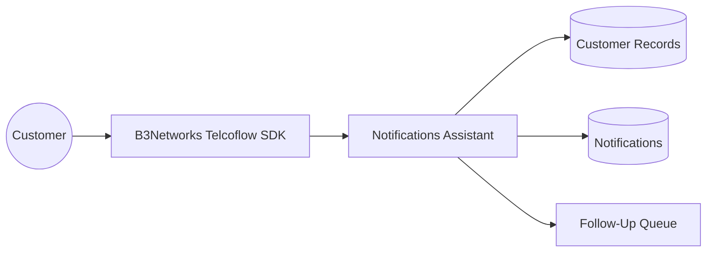
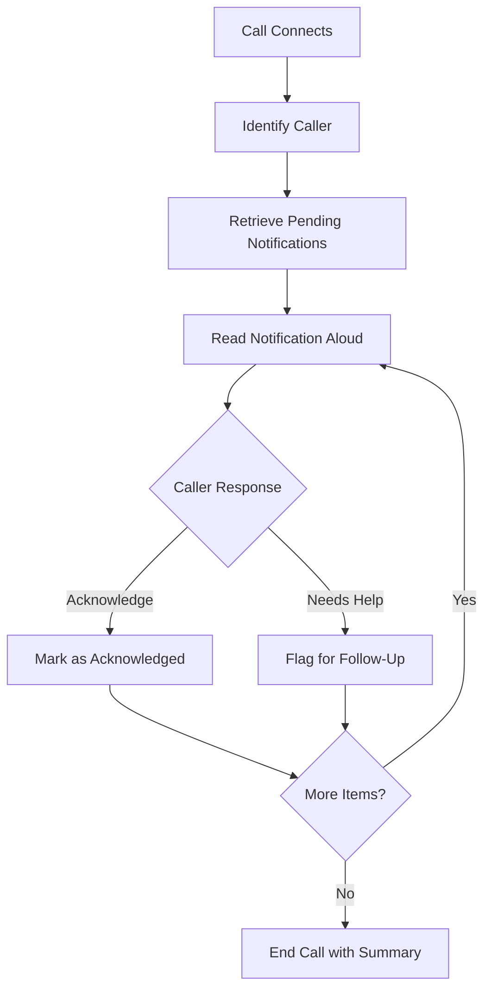
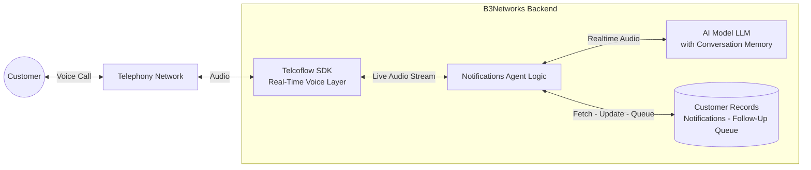
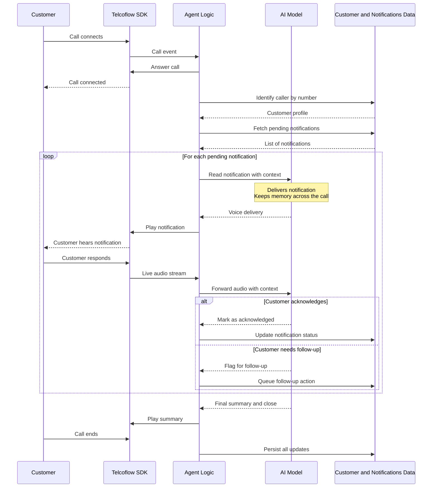

# Case Study: Interactive Notifications Assistant

### Executive Summary

Businesses often need to notify customers about deadlines, reminders, payments, updates, or required actions. But one-way communication channels are limited: emails are ignored, text messages are skimmed, and outbound notices do not always confirm whether the customer actually understood or acknowledged the message.

B3Networks delivers an interactive customer outreach solution built on the Telcoflow SDK and related services. It delivers notifications over voice calls and lets customers acknowledge each one or request follow-up in a natural conversation — turning one-way alerts into two-way engagement.

This transforms notifications from passive outreach into an active, trackable customer interaction.

### Business Challenge

Many organizations struggle with notification effectiveness.

They may send messages about:

- Payment reminders
- Account reviews
- Appointment updates
- Service alerts
- Subscription renewals

But even when notifications are successfully sent, that does not mean they are understood, acknowledged, or acted upon.

This creates operational risk:

- Important notices may be overlooked
- Teams may not know which customers need follow-up
- Customers may need help but have no easy response path
- High-value outreach still creates manual work for operations teams

### Solution Overview

Built on the B3Networks Telcoflow SDK and supported by B3Networks services, the Interactive Notifications Assistant identifies the caller, retrieves pending notifications, reads them out one by one, and records the caller's response for each item.

The caller can:

- Acknowledge a notification
- Indicate uncertainty
- Request human follow-up

The system then updates the notification status accordingly.

This means notification delivery becomes conversational, measurable, and operationally useful.

### Solution Diagrams

**Solution Overview**

**Call Flow**

### How It Works Under The Hood

This section provides a technical view of how the Interactive Notifications Assistant runs at call time. It shows how B3Networks combines the Telcoflow SDK with an AI model and the relevant business systems to deliver the solution.

**Runtime Architecture**

At runtime, this assistant connects four layers:

- **Customer** — the person receiving or calling in for their notifications.
- **Telcoflow SDK** — the real-time voice layer handling the live call and audio stream.
- **Agent Logic** — identifies the caller, fetches their pending notifications, and persists acknowledgements or follow-up flags.
- **AI Model (LLM)** — reads each notification to the caller, listens to the response, and keeps memory across the conversation so the flow feels natural rather than scripted.
- **Business Systems** — customer records, the notifications store, and the follow-up queue for items that require human attention.

**Call Sequence**

In plain terms, a typical notifications call looks like this:

1. A call connects between the customer and the backend (either inbound or outbound).
2. The agent identifies the caller from the phone number and fetches the list of pending notifications from the business systems.
3. For each notification, the AI model reads it to the customer, keeping memory of which items have already been covered.
4. The customer responds; the AI model understands whether they acknowledged the notification or need follow-up, and the agent updates the business systems accordingly.
5. Once all notifications are delivered, the AI model closes the call with a brief summary and all updates are persisted for reporting and operations.

This technical flow follows the same structure as every other solution in the portfolio. Only the agent logic and the business systems change per use case, which is why B3Networks can deliver new solutions quickly while keeping the voice and AI foundation consistent.

### Experience And Workflow

From the customer's perspective, the experience is simple and guided.

Instead of receiving a one-way alert, the caller is taken through each pending item clearly and can respond naturally.

That improves:

- Clarity
- Confirmation
- Convenience
- Confidence that the business will act on unresolved items

It is especially helpful in scenarios where customer understanding matters more than simply sending a message.

### Team Experience

For operations teams, the workflow creates structure.

Rather than wondering whether a notification was seen, the business can distinguish between:

- Items that were acknowledged
- Items that need follow-up
- Customers who may require additional outreach

This improves prioritization and reduces manual tracking effort.

### Business Impact

The Interactive Notifications Assistant turns voice AI into a business operations tool rather than a service channel alone.

#### 1. Higher Notification Effectiveness

Important messages become interactive rather than passive.

#### 2. Better Follow-Up Prioritization

Teams can focus on customers who actually need help instead of manually chasing every message.

#### 3. Better Customer Clarity

Voice delivery can be easier to understand than text-heavy notifications, especially for certain customer groups.

#### 4. Lower Administrative Overhead

Acknowledgement and follow-up status can be captured automatically through the call interaction.

#### 5. Stronger Auditability

Clients gain better visibility into what was communicated and how the customer responded.

### Example Scenario

A customer has three pending notifications: an account review reminder, an overdue payment notice, and a subscription renewal alert.

During the call, the assistant reads each item clearly. The customer acknowledges two of them but asks for human follow-up on the payment issue.

Instead of treating all three notifications equally, the business now knows exactly where action is required.

That is a meaningful improvement in both service quality and internal efficiency.

### What B3Networks Delivers With The Telcoflow SDK

Through the Telcoflow SDK, B3Networks delivers:

- Personalized voice interactions based on caller identity
- Data-driven retrieval of pending notifications
- Real-time customer acknowledgement workflows
- Follow-up routing logic based on customer response
- Integration between voice interactions and notification operations

For clients, this expands the idea of what a phone-based AI agent can do. It is not only for support and routing, but also for business communication workflows.

### Ideal Client Profiles

This use case is especially relevant for:

- Financial services and collections teams
- Insurance providers
- Healthcare administration teams
- Subscription-based businesses
- Utilities and telecom providers
- Any organization that needs confirmed delivery and follow-up on important notices

It is particularly useful where notification response quality matters as much as delivery itself.

### Success Metrics Clients Can Track

Clients can measure outcomes such as:

- Notification acknowledgement rate
- Percentage of items flagged for follow-up
- Reduction in manual outreach effort
- Faster response on unresolved customer issues
- Improvement in payment reminder response
- Overall engagement with notification campaigns

These metrics help make the business case concrete and measurable.

### Sales And Marketing Positioning

The Interactive Notifications Assistant supports a differentiated positioning story:

- Turn notifications into two-way customer interactions
- Know which customers acknowledged and which need help
- Reduce manual follow-up load
- Improve clarity and response rates through voice
- Use the phone channel for more than support alone

### Key Takeaway

The Interactive Notifications Assistant shows how B3Networks combines the Telcoflow SDK and service expertise to modernize an important but often overlooked business process.

By turning static notifications into interactive voice conversations, the solution helps clients improve communication effectiveness, streamline operations, and create a more responsive customer experience — voice AI applied beyond traditional call center automation.

This is one of many solutions B3Networks can deliver on the Telcoflow SDK. Beyond this scenario, B3Networks designs and implements custom voice, telephony, automation, and workflow use cases tailored to each client's operational goals.
