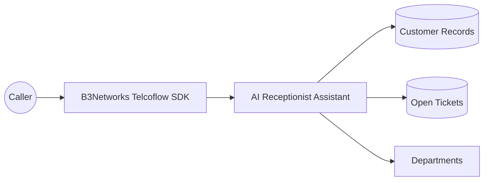
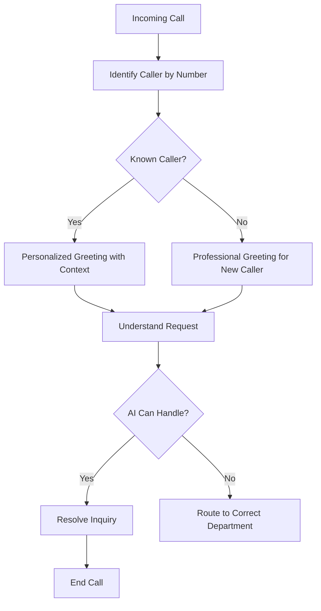

# AI Receptionist Assistant

## Client-Facing Case Study

### Executive Summary

For many businesses, the first phone interaction sets the tone for the entire customer relationship. But traditional receptionist workflows often depend on manual lookups, repeated questions, and transfers that slow the experience down for both callers and internal teams.

This case study highlights how B3Networks delivers a modern inbound call handling solution through the Telcoflow SDK and related services, enabling personalized greetings, caller recognition, contextual support, and intelligent routing.

This makes the phone experience more personalized, more efficient, and more scalable.

### Business Challenge

Reception and front-desk teams are often expected to do many things at once:

- Answer incoming calls quickly
- Identify the caller
- Understand the reason for the call
- Check records or ticket history
- Route the person to the correct department

When this is done manually, the experience can feel slow and repetitive.

Customers may need to:

- State their identity multiple times
- Explain the issue before the team has any context
- Wait while internal staff look up records
- Be transferred without a smooth handoff

These are small moments, but together they shape whether a business feels organized and responsive.

### Solution Overview

Built on the B3Networks Telcoflow SDK and supported by B3Networks services, the AI Receptionist Assistant provides a smarter front door for inbound voice calls.

The assistant can:

- Recognize returning callers
- Personalize the greeting
- Surface open support or account context
- Handle general questions directly
- Route the caller to the correct department when needed

This gives businesses a more intelligent receptionist workflow that still feels natural to the caller.

### Solution Diagrams

**Solution Overview**

**Call Flow**

### Caller Experience

For known callers, the experience becomes more personalized and efficient.

Instead of starting from zero, the assistant can acknowledge the caller and reference relevant context, such as an existing ticket or known issue.

For new callers, the assistant can greet them professionally, understand the request, and either answer common questions or route them appropriately.

This helps the business create a first impression that feels more informed and less transactional.

### Team Experience

For internal teams, the value lies in reduced repetition and smarter call routing.

When the assistant gathers context before transfer, the receiving team is better prepared. That means:

- Less time spent on basic identification
- Better routing accuracy
- More efficient handoffs
- Faster resolution for the caller

This is particularly useful in businesses where multiple departments handle different types of inbound needs.

### Business Impact

This workflow is one of the most client-friendly examples of voice AI because it directly improves the front door of the business.

#### 1. Better Caller Personalization

Known callers can be recognized and served with context-aware interactions.

#### 2. Faster Routing

Calls reach the correct team with less back-and-forth.

#### 3. Reduced Repetition

Customers do not need to repeat the same details as often.

#### 4. Better Team Efficiency

Staff receive better-qualified calls and more relevant context.

#### 5. Stronger Brand Impression

The business sounds modern, organized, and customer-aware from the first interaction.

### Example Scenario

A returning customer calls about an urgent support issue. The assistant recognizes the caller, references the existing support context, and routes the call to the support team with the reason already identified.

A different caller, who is new to the business, asks about enterprise plans. The assistant can answer common high-level questions and capture the lead before ending the conversation or routing the inquiry to sales.

This demonstrates that the same voice workflow can support both customer service and lead-handling functions.

### What B3Networks Delivers With The Telcoflow SDK

This case study highlights how B3Networks can deliver the following through the Telcoflow SDK:

- Caller-aware voice interactions
- Data-informed call handling
- Personalized greetings and contextual service
- Department routing for inbound conversations
- Integration between telephony and customer records

For client education, this is a powerful example because it is easy to understand and immediately relevant to many business environments.

### Ideal Client Profiles

This use case is especially strong for:

- SaaS and software companies
- Professional services firms
- Customer support organizations
- Managed services providers
- Healthcare administration teams
- Any business with multiple inbound call reasons and internal departments

It is especially useful where incoming calls need to be triaged intelligently rather than simply answered.

### Success Metrics Clients Can Track

Clients can assess value through:

- Average time to identify caller intent
- Reduction in misrouted calls
- Improvement in first-transfer accuracy
- Reduction in repetitive questions asked by staff
- Faster resolution times for known customers
- Improved caller satisfaction with the initial interaction

These outcomes help position the receptionist workflow as both a service upgrade and an efficiency upgrade.

### Sales And Marketing Positioning

This case study supports several strong client-facing messages:

- Turn your phone line into a smarter front door
- Personalize inbound calls without increasing staffing
- Route callers more accurately with less repetition
- Create a stronger first impression at scale
- Combine customer context with natural voice interaction

### Key Takeaway

The AI Receptionist Assistant is a strong demonstration of how B3Networks combines the Telcoflow SDK and service delivery expertise to make inbound call handling more intelligent, more personalized, and more efficient.

It is especially effective for marketing and educational purposes because it solves a familiar business challenge in a way that clients can immediately picture in their own operations.

This case study is intended as a representative example of what B3Networks can deliver with the Telcoflow SDK and related services. Beyond this scenario, B3Networks can also design and implement additional custom voice, telephony, automation, and workflow use cases based on each client's operational needs.