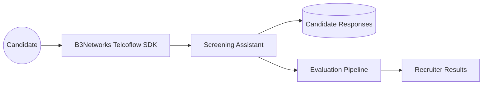
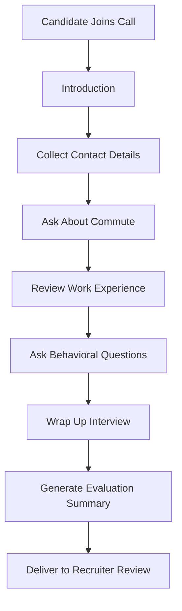

# Candidate Screening Assistant

## Client-Facing Case Study

### Executive Summary

Recruitment teams often spend significant time on early-stage screening calls, collecting the same basic information from every candidate before deciding who should move forward. This is necessary work, but it is repetitive, time-consuming, and difficult to scale when application volume rises.

This case study highlights how B3Networks delivers a voice-based hiring workflow solution through the Telcoflow SDK and related services, helping clients conduct structured screening interviews, capture key applicant information, and support downstream evaluation.

This gives hiring teams a practical way to streamline first-round phone screening while maintaining consistency and professionalism.

### Business Challenge

Early-stage recruitment often creates heavy manual effort for talent teams.

Recruiters may spend large amounts of time:

- Conducting introductory phone screens
- Collecting contact details
- Asking standard availability or commute questions
- Reviewing baseline experience
- Comparing responses across candidates

This is valuable work, but much of it is repetitive and process-driven rather than highly strategic.

When hiring volumes increase, organizations may struggle with:

- Slow candidate response times
- Inconsistent screening quality
- Recruiter overload
- Difficulty comparing candidates fairly at the first stage

### Solution Overview

Built on the B3Networks Telcoflow SDK and supported by B3Networks services, the Candidate Screening Assistant runs a structured voice interview over the phone and collects key candidate information in a consistent format.

The assistant can:

- Introduce the screening process
- Gather contact information
- Ask role-specific screening questions
- Capture responses across multiple interview phases
- Support downstream evaluation and decision-making

This makes the first stage of screening more repeatable, scalable, and easier to review.

### Solution Diagrams

**Solution Overview**

**Call Flow**

### Candidate Experience

From the candidate's perspective, the experience is straightforward and guided.

The assistant asks clear questions in sequence, allowing the candidate to respond naturally over the phone.

This can benefit candidates by:

- Reducing scheduling friction for initial screening
- Creating a more structured interview flow
- Ensuring each applicant is asked the same foundational questions

It also helps organizations deliver a more consistent first-touch recruitment process.

### Team Experience

For hiring teams, the main value is better screening efficiency.

Instead of manually capturing the same initial data every time, recruiters can focus more on:

- Reviewing stronger shortlists
- Handling higher-value interviews
- Engaging top candidates more quickly
- Making decisions with better-structured inputs

The process also supports better consistency across early-stage evaluation.

### Business Impact

This is a strong educational case study because it shows how voice AI can support internal business operations, not only customer-facing service.

#### 1. Faster Early-Stage Screening

High-volume first-round screening becomes easier to manage.

#### 2. More Consistent Candidate Evaluation

Each candidate can be guided through the same core process.

#### 3. Reduced Recruiter Workload

Talent teams spend less time on repetitive intake calls.

#### 4. Better Structured Data Capture

Candidate information is easier to review and compare downstream.

#### 5. More Scalable Hiring Operations

Organizations can handle increased applicant flow without expanding screening effort at the same rate.

### Example Scenario

A company hiring for a customer service role receives a large number of applicants. Instead of asking recruiters to conduct every first-round phone screen manually, the Candidate Screening Assistant collects each applicant's introduction, contact details, commute fit, experience summary, and key behavioral responses.

After the call, the results are available in a structured format for review.

Recruiters can then spend more time on shortlist selection and later-stage interviews rather than repetitive screening intake.

### What B3Networks Delivers With The Telcoflow SDK

This case study demonstrates how B3Networks can deliver the following through the Telcoflow SDK:

- Structured voice interviews over live calls
- Multi-step conversational workflows
- Consistent response capture across defined screening phases
- Integration between call handling and evaluation processes
- Practical automation for internal operations teams

For clients, this is useful because it broadens the perceived value of the SDK beyond support and customer service environments.

### Ideal Client Profiles

This use case is especially relevant for:

- High-volume hiring teams
- BPO and outsourcing firms
- Retail and hospitality recruiters
- Customer service and contact center employers
- Staffing agencies
- Any business running repeated first-stage screening by phone

It is particularly useful where the same foundational questions are asked across many candidates.

### Success Metrics Clients Can Track

Clients can evaluate impact using:

- Number of screening calls completed per day
- Reduction in recruiter time spent on first-round intake
- Speed from application to screening completion
- Consistency of captured screening data
- Candidate progression rate after initial screening
- Improvement in recruiter capacity for later-stage interviews

These metrics help show how the workflow improves recruiting operations in measurable ways.

### Sales And Marketing Positioning

This case study gives B3Networks a strong internal-operations AI story:

- Scale first-round candidate screening without scaling manual effort
- Improve consistency across early-stage hiring
- Reduce repetitive recruiter workload
- Capture structured applicant data through voice
- Apply voice AI to talent operations, not only customer service

### Key Takeaway

The Candidate Screening Assistant is a strong example of how B3Networks combines the Telcoflow SDK and service expertise to automate a structured, repetitive, and operationally important workflow outside the traditional customer service domain.

For marketing and educational purposes, it demonstrates that voice AI can support not only external customer experiences, but also internal business functions such as recruitment and talent operations.

This case study is intended as a representative example of what B3Networks can deliver with the Telcoflow SDK and related services. Beyond this scenario, B3Networks can also design and implement additional custom voice, telephony, automation, and workflow use cases based on each client's operational needs.

### Short Version for Google Doc Cover Page

The Candidate Screening Assistant shows how B3Networks can streamline first-round hiring conversations through a solution built on the Telcoflow SDK. By guiding candidates through a consistent interview flow, capturing key information, and supporting downstream evaluation, the solution helps recruitment teams reduce repetitive workload and scale early-stage screening more effectively. It is a strong example of voice AI improving internal operations as well as customer-facing workflows.
