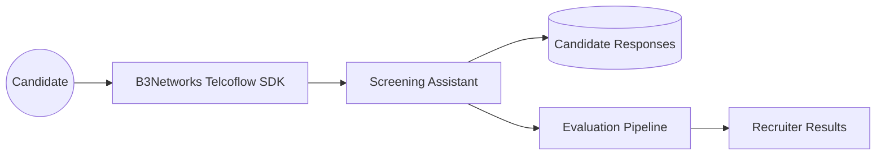
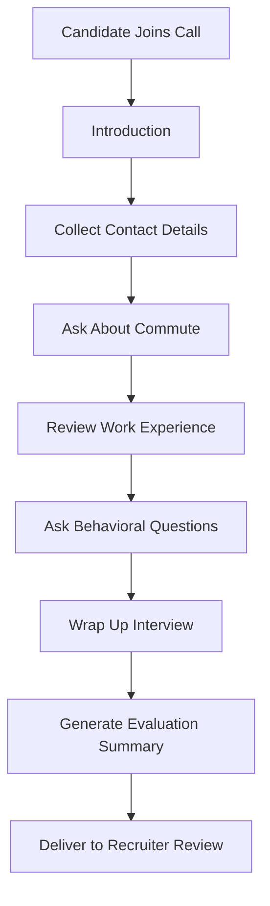
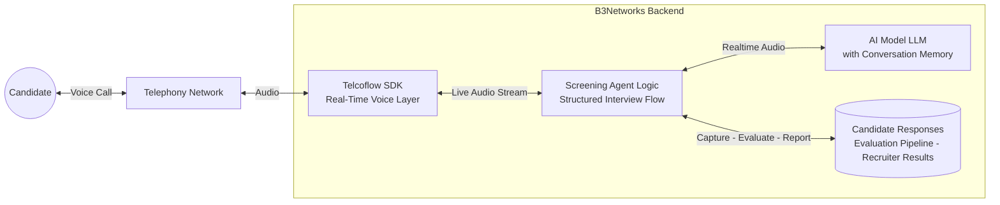
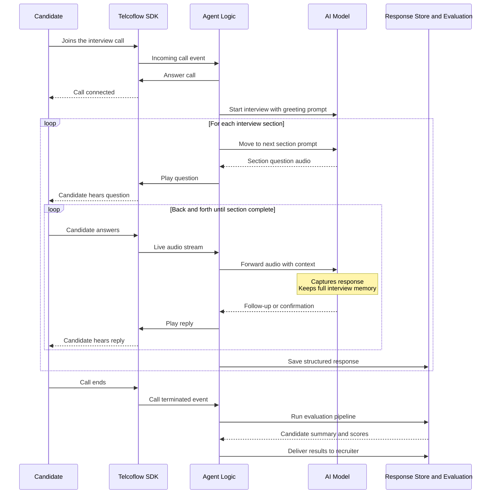

# Case Study: Candidate Screening Assistant

### Executive Summary

Recruitment teams often spend significant time on early-stage screening calls, collecting the same basic information from every candidate before deciding who should move forward. This is necessary work, but it is repetitive, time-consuming, and difficult to scale when application volume rises.

B3Networks delivers a voice-based hiring workflow solution built on the Telcoflow SDK and related services. It conducts structured screening interviews, captures key applicant information, and supports downstream evaluation — letting recruiting teams focus their time on the strongest candidates instead of on scheduling logistics.

This gives hiring teams a practical way to streamline first-round phone screening while maintaining consistency and professionalism.

### Business Challenge

Early-stage recruitment often creates heavy manual effort for talent teams.

Recruiters may spend large amounts of time:

- Conducting introductory phone screens
- Collecting contact details
- Asking standard availability or commute questions
- Reviewing baseline experience
- Comparing responses across candidates

This is valuable work, but much of it is repetitive and process-driven rather than highly strategic.

When hiring volumes increase, organizations may struggle with:

- Slow candidate response times
- Inconsistent screening quality
- Recruiter overload
- Difficulty comparing candidates fairly at the first stage

### Solution Overview

Built on the B3Networks Telcoflow SDK and supported by B3Networks services, the Candidate Screening Assistant runs a structured voice interview over the phone and collects key candidate information in a consistent format.

The assistant can:

- Introduce the screening process
- Gather contact information
- Ask role-specific screening questions
- Capture responses across multiple interview phases
- Support downstream evaluation and decision-making

This makes the first stage of screening more repeatable, scalable, and easier to review.

### Solution Diagrams

**Solution Overview**

**Call Flow**

### How It Works Under The Hood

This section provides a technical view of how the Candidate Screening Assistant runs at call time. It shows how B3Networks combines the Telcoflow SDK with an AI model and the relevant business systems to deliver the solution.

**Runtime Architecture**

At runtime, this assistant connects four layers:

- **Candidate** — the applicant joining the interview call.
- **Telcoflow SDK** — the real-time voice layer handling the live call and audio stream.
- **Agent Logic** — walks the interview through a structured set of sections and records each response in a structured form.
- **AI Model (LLM)** — asks each question, listens to the candidate's answer, and keeps memory of the full interview so it can pose natural follow-up questions.
- **Business Systems** — the candidate response store, the evaluation pipeline, and the recruiter results delivery layer.

**Call Sequence**

In plain terms, a typical screening call looks like this:

1. A candidate joins the interview call and the AI model opens with a greeting prompt prepared by the agent logic.
2. The agent walks the interview through a structured set of sections one at a time, such as introduction, contact details, commute, work experience, and behavioral questions.
3. Within each section, the AI model asks the question, the candidate responds, and the SDK streams the audio to the AI model. The AI model captures the answer and maintains memory of the full interview so it can pose natural follow-up questions.
4. After each section, the agent saves the structured response to the candidate store.
5. When the call ends, the agent runs the evaluation pipeline to produce candidate scores and a summary, which are delivered to the recruiter for review.

This technical flow follows the same structure as every other solution in the portfolio. Only the agent logic and the business systems change per use case, which is why B3Networks can deliver new solutions quickly while keeping the voice and AI foundation consistent.

### Candidate Experience

From the candidate's perspective, the experience is straightforward and guided.

The assistant asks clear questions in sequence, allowing the candidate to respond naturally over the phone.

This can benefit candidates by:

- Reducing scheduling friction for initial screening
- Creating a more structured interview flow
- Ensuring each applicant is asked the same foundational questions

It also helps organizations deliver a more consistent first-touch recruitment process.

### Team Experience

For hiring teams, the main value is better screening efficiency.

Instead of manually capturing the same initial data every time, recruiters can focus more on:

- Reviewing stronger shortlists
- Handling higher-value interviews
- Engaging top candidates more quickly
- Making decisions with better-structured inputs

The process also supports better consistency across early-stage evaluation.

### Business Impact

This is a strong educational case study because it shows how voice AI can support internal business operations, not only customer-facing service.

#### 1. Faster Early-Stage Screening

High-volume first-round screening becomes easier to manage.

#### 2. More Consistent Candidate Evaluation

Each candidate can be guided through the same core process.

#### 3. Reduced Recruiter Workload

Talent teams spend less time on repetitive intake calls.

#### 4. Better Structured Data Capture

Candidate information is easier to review and compare downstream.

#### 5. More Scalable Hiring Operations

Organizations can handle increased applicant flow without expanding screening effort at the same rate.

### Example Scenario

A company hiring for a customer service role receives a large number of applicants. Instead of asking recruiters to conduct every first-round phone screen manually, the Candidate Screening Assistant collects each applicant's introduction, contact details, commute fit, experience summary, and key behavioral responses.

After the call, the results are available in a structured format for review.

Recruiters can then spend more time on shortlist selection and later-stage interviews rather than repetitive screening intake.

### What B3Networks Delivers With The Telcoflow SDK

Through the Telcoflow SDK, B3Networks delivers:

- Structured voice interviews over live calls
- Multi-step conversational workflows
- Consistent response capture across defined screening phases
- Integration between call handling and evaluation processes
- Practical automation for internal operations teams

For clients, this is useful because it broadens the perceived value of the SDK beyond support and customer service environments.

### Ideal Client Profiles

This use case is especially relevant for:

- High-volume hiring teams
- BPO and outsourcing firms
- Retail and hospitality recruiters
- Customer service and contact center employers
- Staffing agencies
- Any business running repeated first-stage screening by phone

It is particularly useful where the same foundational questions are asked across many candidates.

### Success Metrics Clients Can Track

Clients can evaluate impact using:

- Number of screening calls completed per day
- Reduction in recruiter time spent on first-round intake
- Speed from application to screening completion
- Consistency of captured screening data
- Candidate progression rate after initial screening
- Improvement in recruiter capacity for later-stage interviews

These metrics help show how the workflow improves recruiting operations in measurable ways.

### Sales And Marketing Positioning

The Candidate Screening Assistant gives B3Networks a compelling internal-operations story:

- Scale first-round candidate screening without scaling manual effort
- Improve consistency across early-stage hiring
- Reduce repetitive recruiter workload
- Capture structured applicant data through voice
- Apply voice AI to talent operations, not only customer service

### Key Takeaway

With the Candidate Screening Assistant, B3Networks combines the Telcoflow SDK and service expertise to automate a structured, repetitive, and operationally important workflow outside the traditional customer service domain.

The solution shows that voice AI can support not only external customer experiences, but also internal business functions such as recruitment and talent operations.

This is one of many solutions B3Networks can deliver on the Telcoflow SDK. Beyond this scenario, B3Networks designs and implements custom voice, telephony, automation, and workflow use cases tailored to each client's operational goals.