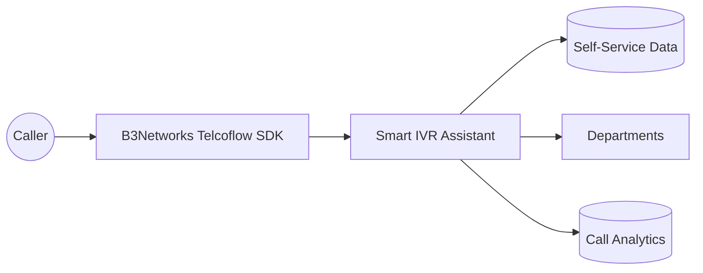
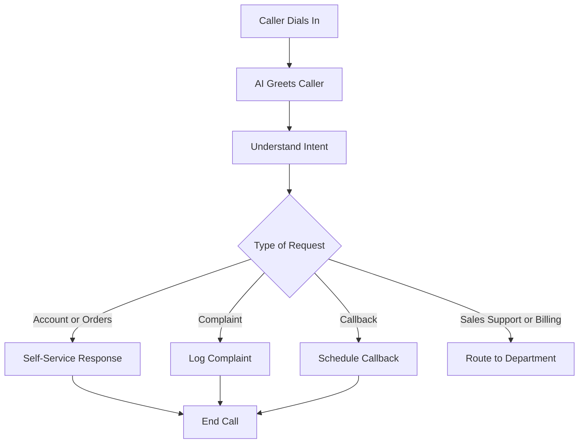
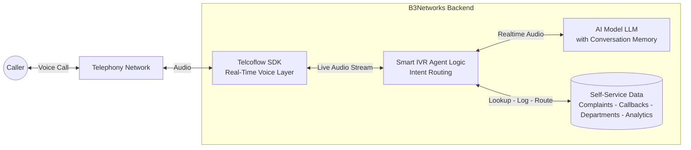
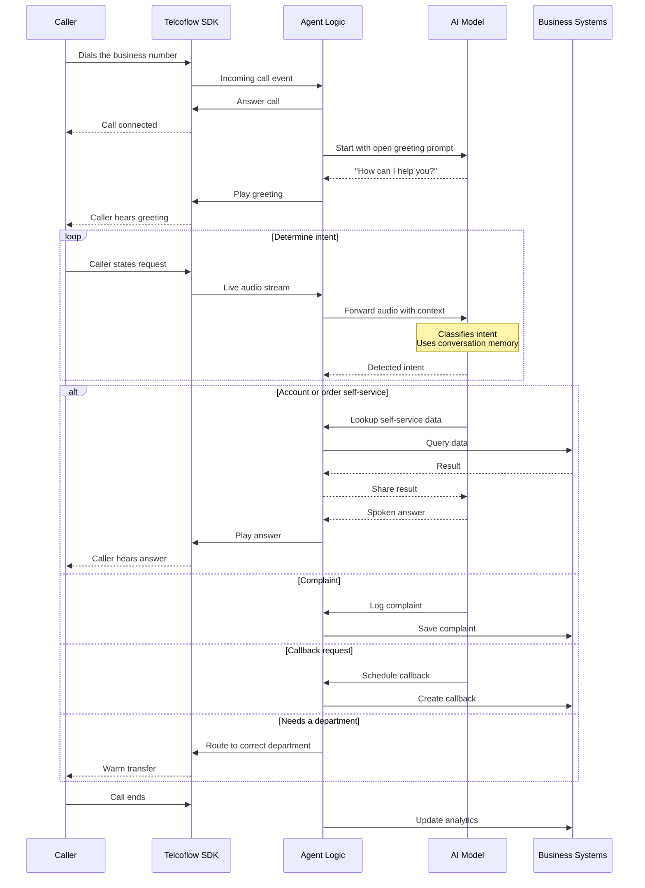

# Case Study: Smart IVR Assistant

### Executive Summary

Traditional phone menus create friction. Customers often get stuck in long menu trees, press the wrong option, restart the process, or give up before reaching the right destination.

B3Networks delivers a modern conversational IVR solution built on the Telcoflow SDK and related services. It replaces traditional keypad menus with a Smart IVR Assistant that lets callers simply say what they need in natural language — reaching the right outcome faster, without menu trees or wait queues for routine requests.

Instead of "press 1 for sales" and "press 2 for support," the caller can speak normally, and the system can either complete the request or route the conversation to the right department.

This is one of the clearest examples of how voice AI can modernize a widely understood business process.

### Business Challenge

Traditional IVR systems have several limitations:

- They are frustrating for callers
- They create unnecessary delay before resolution
- They are rigid when customers have multiple needs
- They are harder to keep current as business options change
- They provide limited insight beyond menu usage

For many businesses, IVR is tolerated rather than appreciated.

That creates an opportunity: if the phone menu can become conversational, the entire front-end experience can feel more modern and more effective.

### Solution Overview

Built on the B3Networks Telcoflow SDK and supported by B3Networks services, the Smart IVR Assistant replaces rigid keypad-based menus with natural voice interaction.

The assistant can:

- Understand the reason for the call conversationally
- Handle certain requests directly through self-service
- Route callers to departments such as sales, support, or billing
- Capture outcomes and analytics from each interaction

This gives clients a much more flexible and user-friendly alternative to traditional IVR design.

### Solution Diagrams

**Solution Overview**

**Call Flow**

### How It Works Under The Hood

This section provides a technical view of how the Smart IVR Assistant runs at call time. It shows how B3Networks combines the Telcoflow SDK with an AI model and the relevant business systems to deliver the solution.

**Runtime Architecture**

At runtime, this assistant connects four layers:

- **Caller** — anyone calling the main business number for any reason.
- **Telcoflow SDK** — the real-time voice layer handling the live call and audio stream.
- **Agent Logic** — takes the classified intent from the AI model and chooses whether to self-serve, log, schedule, or route.
- **AI Model (LLM)** — opens with a natural greeting, understands the caller's intent without a keypad menu, and keeps memory of the conversation.
- **Business Systems** — self-service data sources, complaint log, callback queue, department routing, and call analytics.

**Call Sequence**

In plain terms, a typical Smart IVR call looks like this:

1. A caller dials the business number and the AI model opens with an open greeting such as "How can I help you?". There is no keypad menu.
2. The caller speaks freely about what they need. The Telcoflow SDK streams the audio and the AI model classifies the intent using its conversation memory.
3. For self-service requests, such as account balance or order status, the AI model asks the agent to query the relevant data source and then reads the answer back to the caller.
4. For complaints, the AI model captures the issue and the agent logs it. For callback requests, the agent schedules the callback. For specialist needs, the call is transferred to the correct department with a warm handoff.
5. On every call, analytics are updated so the business can monitor intent distribution, resolution rates, and call patterns.

This technical flow follows the same structure as every other solution in the portfolio. Only the agent logic and the business systems change per use case, which is why B3Networks can deliver new solutions quickly while keeping the voice and AI foundation consistent.

### Caller Experience

For the caller, the experience is dramatically simpler.

Instead of navigating layered menus, the interaction begins with a natural prompt such as:

"How can I help you today?"

The caller can then ask for:

- Account information
- Order updates
- Complaint logging
- Callback scheduling
- Sales support
- Technical help
- Billing assistance

This creates a faster path to resolution and a more modern brand impression.

### Business Impact

This is one of the strongest voice AI use cases because the pain of traditional IVR is almost universal.

#### 1. Lower Caller Friction

Customers can describe their needs naturally instead of learning the menu structure.

#### 2. Faster Resolution

The system can move directly to handling or routing rather than forcing menu navigation first.

#### 3. Better Self-Service

Simple requests can be resolved during the call without human involvement.

#### 4. More Flexible Operations

The workflow can adapt to changing business needs more easily than static menu trees.

#### 5. Better Analytics

Businesses can understand caller intent and outcomes in a more meaningful way than simple menu selections.

### Example Scenario

A caller says they want to know the status of an order. The assistant retrieves the relevant order information and responds directly.

Another caller says they were charged twice. The assistant recognizes that this should go to billing and routes the call accordingly.

A third caller reports a damaged delivery, logs the complaint, and offers to schedule a callback.

These examples show that the experience can support both self-service and smart routing in a single conversational front end.

### What B3Networks Delivers With The Telcoflow SDK

Through the Telcoflow SDK, B3Networks delivers:

- Natural-language front-end call handling
- Voice-based self-service flows
- Department routing based on caller intent
- Complaint and callback workflow support
- Operational analytics on call reasons and outcomes

For clients, this is one of the easiest and most compelling use cases to understand because it replaces a familiar but painful legacy system.

### Ideal Client Profiles

This use case is especially relevant for:

- Telecom and utilities providers
- Retail and e-commerce businesses
- Logistics and delivery companies
- SaaS and subscription businesses
- Customer support organizations
- Any business currently relying on a traditional IVR tree

It is particularly attractive where large inbound call volumes make phone-menu friction highly visible.

### Success Metrics Clients Can Track

Clients can measure value using:

- Reduction in call abandonment during menu navigation
- Increase in self-service completion rate
- Faster time to route or resolution
- Improved caller satisfaction with the phone journey
- Better insight into top inbound intents
- Reduced pressure on live teams for routine requests

These outcomes help frame Smart IVR as both a customer experience upgrade and an operational modernization project.

### Sales And Marketing Positioning

The Smart IVR Assistant supports client-facing messages such as:

- Replace rigid phone menus with natural conversation
- Reduce caller frustration and speed up service
- Combine self-service and smart routing in one voice workflow
- Modernize IVR without redesigning the whole contact center
- Turn call intent into actionable business analytics

### Key Takeaway

The Smart IVR Assistant is one of the clearest examples of how B3Networks combines the Telcoflow SDK and service delivery expertise to modernize a familiar business experience with immediate customer impact.

Nearly every client already understands the pain of legacy IVR systems, which makes the value of conversational voice easy to recognize — improved usability and lower operational cost, without rebuilding the entire phone system.

This is one of many solutions B3Networks can deliver on the Telcoflow SDK. Beyond this scenario, B3Networks designs and implements custom voice, telephony, automation, and workflow use cases tailored to each client's operational goals.
